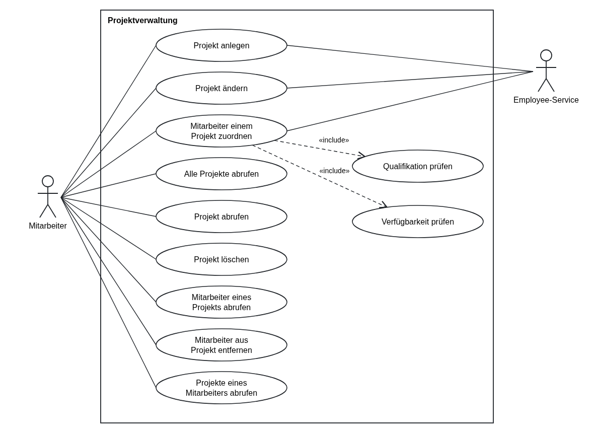

# Anforderungsdefinition Project-Management-Service

Der Project-Management-Service ist ein REST-Microservice zur Projektverwaltung. Seine Nutzer
sind Mitarbeitende der HiTec GmbH.

## Ein Projekt

| Angabe | Pflicht | Hinweis |
|---|---|---|
| ID | ja | vergibt der Service |
| Bezeichnung | ja | |
| ID des verantwortlichen Mitarbeiters | ja | muss im Employee-Service existieren |
| ID des Kunden | ja | nur eine Zahl; ein Kunden-Service existiert noch nicht, es gibt nichts zu prüfen |
| Ansprechperson beim Kunden | nein | Name als Text |
| Kommentar zum Projektziel | nein | |
| Startdatum | ja | |
| geplantes Enddatum | ja | nicht vor dem Startdatum |
| tatsächliches Enddatum | nein | wird gesetzt, wenn das Projekt fertig ist |

Einem Projekt sind außerdem Mitarbeitende zugeordnet, jeweils **mit einer Rolle**. Die Rolle ist
eine Qualifikation aus dem Employee-Service (zum Beispiel „Java“). Eine Person ist einem Projekt
höchstens **einmal** zugeordnet, also auch nicht ein zweites Mal mit einer anderen Rolle.

## Was der Service können muss

Das Use-Case-Diagramm zeigt alle Anwendungsfälle. **Muss** heißt: gehört in euren Sprint.
**Kann** heißt: erst, wenn alle Muss-Anforderungen fertig sind.

| Anwendungsfall | Priorität |
|---|---|
| Projekt anlegen | **Muss** |
| Alle Projekte abrufen (mit allen Angaben) | **Muss** |
| Ein Projekt anhand seiner ID abrufen | **Muss** |
| Projekt löschen | **Muss** |
| Mitarbeiter einem Projekt zuordnen | **Muss** |
| Mitarbeiter eines Projekts abrufen: Projekt-ID, Bezeichnung und die Liste der Mitarbeitenden mit ID und Rolle | **Muss** |
| Projekt ändern | Kann |
| Mitarbeiter aus einem Projekt entfernen | Kann |
| Projekte eines Mitarbeiters abrufen: Mitarbeiter-ID einmal, dazu die Liste seiner Projekte mit ID, Bezeichnung, Start- und Enddatum und Rolle | Kann |

## Fachliche Regeln

**Mitarbeiter prüfen.** Überall, wo eine Mitarbeiter-ID hereinkommt, fragt euer Service den
Employee-Service, ob es sie gibt.

**Qualifikation prüfen.** Beim Zuordnen gebt ihr zusätzlich die Rolle an, und zwar als ID einer
Qualifikation aus dem Employee-Service. Die Person muss diese Qualifikation besitzen; ihre
Qualifikationen liefert der Employee-Service.

**Verfügbarkeit prüfen.** Eine Person darf einem Projekt nur zugeordnet werden, wenn sie in
dessen Zeitraum nicht schon in einem anderen Projekt eingeplant ist. Genau so:

- Es zählen nur die **geplanten** Zeiträume: Startdatum bis geplantes Enddatum. Das tatsächliche
  Enddatum spielt für diese Prüfung keine Rolle.
- Beide Tage gehören zum Zeitraum.
- Zwei Zeiträume überschneiden sich, wenn der eine spätestens an dem Tag beginnt, an dem der
  andere endet, **und** umgekehrt.

| Projekt A (Person ist schon eingeplant) | Projekt B (Person soll dazu) | Ergebnis |
|---|---|---|
| 01.03. – 31.03. | 15.03. – 30.04. | überschneidet sich → abweisen |
| 01.03. – 31.03. | 31.03. – 15.04. | überschneidet sich (31.03. liegt in beiden) → abweisen |
| 01.03. – 31.03. | 01.04. – 30.04. | keine Überschneidung → erlaubt |

**Projekt löschen.** Wird ein Projekt gelöscht, verschwinden auch seine Zuordnungen. Die
gelöschten Zuordnungen zählen danach bei keiner Verfügbarkeitsprüfung mehr mit. Die
Mitarbeitenden im Employee-Service bleiben unverändert.

## API-Richtlinie der HiTec GmbH

Alle Services der HiTec GmbH antworten im Fehlerfall einheitlich:

| Status | Wann |
|---|---|
| 400 Bad Request | Die Anfrage selbst ist ungültig: Pflichtfeld fehlt, Format falsch |
| 401 Unauthorized | kein oder ungültiges Token |
| 404 Not Found | Eine angesprochene Ressource gibt es nicht, egal ob im eigenen oder im fremden Service |
| 409 Conflict | Die Anfrage widerspricht dem aktuellen Zustand, etwa weil etwas schon existiert oder belegt ist |
| 422 Unprocessable Content | Die Anfrage ist formal richtig, aber fachlich nicht zulässig |
| 503 Service Unavailable | Ein benötigter fremder Service ist nicht erreichbar |

Welcher Fehlerfall welchen Status bekommt, entscheidet ihr in euren Akzeptanzkriterien anhand
dieser Tabelle.

## Qualität

- Für jeden Endpunkt gibt es einen **Integrationstest für den Erfolgsfall** („Happy Path“).
- Der Service ist per **OpenAPI/Swagger** dokumentiert.
- Die Requests stehen in einer `.http`-Datei, sodass jede und jeder aus der Gruppe sie
  ausprobieren kann.
